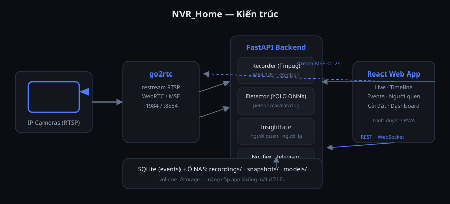

# NVR_Home — Quản lý camera tại nhà

Hệ thống Web NVR tự xây, dùng cá nhân cho gia đình: xem trực tiếp, ghi hình 24/7,
AI phát hiện người/xe/mèo/chó, nhận diện người quen, phát lại theo timeline và
thông báo Telegram/Pushover — tất cả trong 2 container Docker.



## Tính năng

| Nhóm | Chi tiết |
|---|---|
| **Trực tiếp** | Grid 1/4/6/9/16, streaming MSE độ trễ <1–2s qua go2rtc, âm thanh, PTZ (ONVIF), fullscreen, chụp ảnh |
| **Ghi hình** | Liên tục 24/7 hoặc chỉ khi có sự kiện (mỗi camera một chế độ), file MP4 10s/segment, tự xoá theo số ngày / giới hạn dung lượng |
| **Phát lại** | Timeline heat-strip 24h, vạch màu theo loại event, click-để-tua, phím tắt (Space, ←/→), tải clip, lưu khung hình |
| **AI** | YOLOv10n/v8n ONNX (CPU) phát hiện person/car/cat/dog, chọn class + vẽ vùng quan tâm từng camera, ngưỡng tin cậy, chống báo nhầm |
| **Người quen** | InsightFace buffalo_l — thêm người thân từ vài ảnh, event tự gắn tên, cảnh báo người lạ (tùy chọn) |
| **Thông báo** | Telegram / Pushover kèm ảnh, lọc loại event, cooldown, giờ yên tĩnh |
| **Bảo mật** | 1 tài khoản admin (JWT), đổi mật khẩu trong app; khuyến nghị Tailscale khi truy cập ngoài nhà |

## Chạy thử ngay (đã có camera demo)

**Trên Ubuntu homelab — 1 dòng:**

```bash
curl -fsSL https://raw.githubusercontent.com/pqminh-4/NVR_Home/main/scripts/remote-install.sh | bash
```

Script tự cài Docker (nếu thiếu), tải mã nguồn, tạo `.env` + mật khẩu, build và
khởi động. Muốn ghi hình vào ổ lớn, thêm đường dẫn cuối lệnh:

```bash
curl -fsSL https://raw.githubusercontent.com/pqminh-4/NVR_Home/main/scripts/remote-install.sh | bash -s -- /mnt/data/nvr
```

**Trên máy đã có mã nguồn:**

```bash
cp .env.example .env          # sửa NVR_ADMIN_PASSWORD
docker compose up -d --build
```

Mở **http://localhost:8080** → đăng nhập `admin` / mật khẩu trong `.env`.
Camera demo (nguồn sinh ảnh, không cần thiết bị) sẽ tự nạp lần đầu để bạn thấy
đủ ghi hình, sự kiện, timeline. Vào **Cài đặt → Camera** xoá demo và thêm camera thật.

## Thêm camera thật

Vào **Cài đặt → Camera → Thêm camera**, dán URL RTSP (bấm **Test** để kiểm tra).
Ví dụ URL phổ biến (thay user/pass/IP):

| Hãng | Main stream | Sub stream (cho AI) |
|---|---|---|
| Hikvision | `rtsp://u:p@IP:554/Streaming/Channels/101` | `.../Channels/102` |
| Dahua | `rtsp://u:p@IP:554/cam/realmonitor?channel=1&subtype=0` | `subtype=1` |
| Tapo/TP-Link | `rtsp://u:p@IP:554/stream1` | `stream2` |
| Ezviz | `rtsp://u:p@IP:554/h264_stream` (bật EZVIZ RTSP trong app) | — |

Khuyến nghị: điền cả **sub stream** (640×360) — AI dùng sub nên CPU nhẹ hơn nhiều.
Cấu hình khởi tạo ban đầu cũng có thể đặt trong `config/cameras.yml` (chỉ đọc khi DB trống).

## Triển khai lên Ubuntu Homelab

**Cách nhanh (1 lệnh):** copy dự án lên máy Ubuntu rồi chạy script tự động
(cài Docker nếu thiếu, tạo .env + mật khẩu, trỏ ổ lớn, build & khởi động):

```bash
bash scripts/install-ubuntu.sh              # ghi hình trong ./storage
bash scripts/install-ubuntu.sh /mnt/data/nvr   # hoặc trỏ sang ổ lớn
```

Hướng dẫn chi tiết từng bước (scp từ Windows, fstab ổ dữ liệu, Tailscale truy
cập ngoài nhà, backup, xử lý sự cố): **[docs/deploy-ubuntu.md](docs/deploy-ubuntu.md)**.

1. Copy cả thư mục `NVR_Home` lên NAS (hoặc `git clone`), tạo `.env`.
2. Trỏ `./storage` sang ổ lớn: sửa `volumes` trong `docker-compose.yml` hoặc
   để nguyên và đặt thư mục dự án trên ổ dữ liệu.
3. `docker compose up -d --build` — xong. App ở cổng **8080**, go2rtc ở **1984**.
4. Nâng cấp: `git pull && docker compose up -d --build` — dữ liệu (DB + ghi hình)
   nằm riêng trong `storage/` nên không mất.

**Truy cập ngoài nhà:** cài [Tailscale](https://tailscale.com) trên NAS và điện thoại
(miễn phí, không mở port). Truy cập `http://<tên-nas-tailscale>:8080`.

**Nhận diện người quen (tùy chọn):**

```bash
docker exec nvr-home pip install -r backend/requirements-faces.txt
docker compose restart nvr
```

## Cấu trúc dự án

```
backend/app/
  main.py               FastAPI + lifespan (khởi động recorder/detector)
  api/                  auth, cameras, events, recordings, faces, settings, system
  services/
    go2rtc.py           đồng bộ camera lên go2rtc (restream RTSP nội bộ)
    recorder.py         ffmpeg segment 10s + retention + scan phát lại
    detector.py         thread/camera: đọc frame → AI → Event → WS/thông báo
    yolo.py             YOLO ONNX (tự tải model lần đầu)
    faces.py            InsightFace enroll + so khớp
    notifier.py         Telegram/Pushover
    demo_stream.py      MJPEG cho camera demo
frontend/src/
  features/             live, timeline, events, faces, settings, dashboard
  lib/                  api, ws, player MSE, format
  components/ui/        design system (Tailwind, dark/light)
storage/                db + recordings + snapshots + models (không commit)
```

## Vấn đề thường gặp

- **Live "Đang kết nối"**: kiểm tra go2rtc (`http://NAS:1984`), camera RTSP có
  đúng không; trình duyệt cần hỗ trợ MSE (Chrome/Edge/Safari/Firefox đều OK).
- **CPU cao**: giảm `detect_fps` (1–2), dùng sub stream, giảm số camera detect.
- **Không có sự kiện AI**: model YOLO tải lần đầu cần internet; kiểm tra
  `docker logs nvr-home | grep yolo`. Có thể đặt tay file `.onnx` vào
  `storage/models/`.
- **Quên mật khẩu**: xoá `storage/db/nvr.db` (mất cả cấu hình camera) rồi restart —
  mật khẩu sẽ lấy lại từ `.env`.

## Phát triển trên máy tính

```bash
python -m venv .venv && .venv/Scripts/pip install -r backend/requirements.txt
.venv/Scripts/python -m uvicorn backend.app.main:app --reload   # API :8000
cd frontend && npm install && npm run dev                         # Vite :5173 (proxy /api)
```
